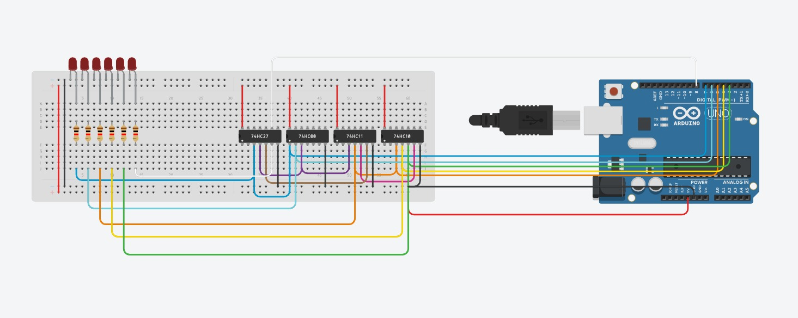

 

# LogicCircuit-Diagnosis

### Project Overview
This project involves designing, testing, and diagnosing a combinational logic circuit using an Arduino UNO and several logic gates implemented with 74HC-series ICs. The goal is to ensure circuit reliability, detect potential faults, and minimize the number of test cases required for validation.

## Hardware Components
Arduino UNO - Used to generate input signals and read output values, allowing automation of the testing process.
Breadboard - Serves as the platform for connecting logic ICs and other components without soldering.
Logic ICs (74HC series):
74HC27 -Triple 3-input NOR gates
74HC08 - Quad 2-input AND gates
74HC11 - Triple 3-input AND gates
74HC10 - Triple 3-input NAND gates
LEDs - Indicate circuit output states for visual verification.
Resistors - Limit current through LEDs and stabilize signals.

## Testing Objectives
The project focuses on conducting reliability and diagnostic tests to:

-Verify the correctness of the logic circuit.
-Detect possible faults or incorrect connections.
-Optimize the test process by identifying a minimal set of test cases needed to fully diagnose the circuit.
## Test Results
# Essential Tests
No essential tests were identified. This means there are no mandatory test cases required to confirm the circuit's correct operation.
# Equivalent Input Sets
Certain input combinations were found to produce the same output, meaning they are logically equivalent. These include:
a0, a1, b0, b1, c0, c1, d0, d1, e0, e1, f1, g0, h0, h1, i0, i1, j1, k0, k1, l1, m0, n0, n1, z0
This result indicates that multiple inputs have redundant effects, reducing the total number of test cases needed.

# Minimal Test Set
The analysis identified only two test cases that are sufficient to diagnose the circuit:

01000
11111

These two input combinations cover all possible logic states and fault detection scenarios, eliminating the need for additional tests.

## Conclusions & Possible Improvements

# Reliability - The circuit appears stable and functional with no additional essential tests required.
# Optimization -  The number of test cases has been minimized to just two, making the diagnosis process highly efficient.
# Practical Use - This testing approach is useful for verifying logic circuits in embedded systems and digital controllers.